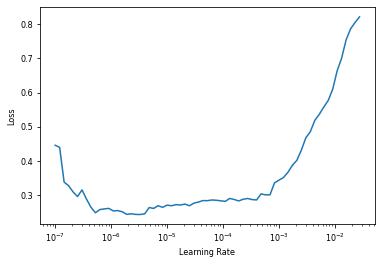

```python
!conda install -y graphviz
!pip install -Uqq fastbook

import fastbook
fastbook.setup_book()
```

    Collecting package metadata (current_repodata.json): done
    Solving environment: done
    
    
    ==> WARNING: A newer version of conda exists. <==
      current version: 4.8.3
      latest version: 4.9.2
    
    Please update conda by running
    
        $ conda update -n base -c defaults conda
    
    
    
    # All requested packages already installed.
    


    /opt/conda/lib/python3.7/site-packages/fastbook/__init__.py:22: UserWarning: Missing `graphviz` - please run `conda install fastbook`
      except ModuleNotFoundError: warn("Missing `graphviz` - please run `conda install fastbook`")


```python
from fastai import *
from fastcore import *
from fastai.vision.all import *
from fastai.callback.tensorboard import *
```


```python
import fastai
import fastcore
fastai.__version__
fastcore.__version__
```


    '1.3.2'


# Colorectal Cancer histology toy model
In this toy datamodel, I will try to create a classifier to predict histology subtype. 
Data is from Kather, et al, from this Kaggle: https://www.kaggle.com/kmader/colorectal-histology-mnist. This is a subset of the larger datasset from this manuscript: https://dx.doi.org/10.1038%2Fsrep27988

### Access Data
There are 8 different histology types:
1. Tumor
2. Stroma
3. Complex
4. Lymph
5. Debris
6. Musocal
7. Adipose
8. Empty

Each folder is labeled by type of histology. There 626 images within each folder, all 150x150 pixels. Training and validation sets are not separated initially.


```python
data_path = Path("./data/")
```


```python
data_path.ls()
```


    (#9) [Path('data/.ipynb_checkpoints'),Path('data/TUMOR'),Path('data/STROMA'),Path('data/COMPLEX'),Path('data/LYMPHO'),Path('data/DEBRIS'),Path('data/MUCOSA'),Path('data/ADIPOSE'),Path('data/EMPTY')]


We will load the image files into the dataloader.


```python
initial_db = DataBlock(blocks = (ImageBlock, CategoryBlock),
                 get_items=get_image_files,
                 splitter=RandomSplitter(seed=42),
                 get_y=parent_label,
                 item_tfms=Resize(460),
                 batch_tfms=aug_transforms(size=224, min_scale=0.75))
initial_dls = initial_db.dataloaders(data_path)
```

Now we will see if we loaded the data correctly


```python
initial_dls.show_batch(nrows=1, ncols=3)
```


## Initial base model

Now let us try to make a model right away. Arbitrarily choose ResNet18 with 4 epochs. Our loss will be cross entropy, and metric accuracy. 


```python
cbs = [TensorBoardCallback(projector=True)]
```


```python
initial_learn = cnn_learner(initial_dls, resnet18, metrics=accuracy)
initial_learn.fine_tune(4, cbs = cbs)
```

    epoch     train_loss  valid_loss  accuracy  time    
    0         1.104734    0.367031    0.879000  00:53     
    epoch     train_loss  valid_loss  accuracy  time    
    0         0.500442    0.248770    0.914000  00:38     
    1         0.387456    0.188451    0.938000  00:36     
    2         0.288400    0.183529    0.948000  00:36     
    3         0.249463    0.168136    0.950000  00:35     


### Results of initial model

Our quick model has an accuracy of 95.0%. Let us see what is the most error-prone classification with a confusion matrix.


```python
initial_learn
```


    <fastai.learner.Learner at 0x7f2b776b4890>


```python
interp = ClassificationInterpretation.from_learner(initial_learn)
interp.plot_confusion_matrix()
```

    █


What did the model predict the worst?


```python
plt.rcParams.update({'font.size': 8})
interp.plot_top_losses(5, nrows=2)
```


Now we save the model


```python
initial_learn.export()
```

## Opitmize data augmentation

Note that for histology tiles, they are already zoomed in at 100x. We do not want to resize the images on any augmentation. We will presize to 460, allow for augmentation, and then reduce to 224. We will only allow for rotation and changes in color for batch transformations (set min_zoom and max_zoom to 1.0, also set warp to 0). 


```python
augmented_db = DataBlock(blocks = (ImageBlock, CategoryBlock),
                 get_items=get_image_files, 
                 splitter=RandomSplitter(valid_pct=0.2, seed=42),
                 get_y=parent_label,
                 item_tfms=Resize(460),
                 batch_tfms=aug_transforms(mult=1.0, do_flip=True, flip_vert=True, max_rotate=10.0, 
                                           min_zoom=1.0, max_zoom=1.0, max_lighting=0.2, max_warp=0, 
                                           p_affine=0.75, p_lighting=0.75, xtra_tfms=None, size=224, 
                                           mode='bilinear', pad_mode='reflection', align_corners=True, 
                                           batch=64, min_scale=1.0))
augmented_dls = augmented_db.dataloaders(data_path)
```


```python
augmented_dls.show_batch(nrows=1, ncols=3)
```


```python
augment_learn = cnn_learner(augmented_dls, resnet18, metrics=accuracy)
augment_learn.fine_tune(4)
```


<table border="1" class="dataframe">
  <thead>
    <tr style="text-align: left;">
      <th>epoch</th>
      <th>train_loss</th>
      <th>valid_loss</th>
      <th>accuracy</th>
      <th>time</th>
    </tr>
  </thead>
  <tbody>
    <tr>
      <td>0</td>
      <td>1.057307</td>
      <td>0.373020</td>
      <td>0.877000</td>
      <td>00:08</td>
    </tr>
  </tbody>
</table>


<table border="1" class="dataframe">
  <thead>
    <tr style="text-align: left;">
      <th>epoch</th>
      <th>train_loss</th>
      <th>valid_loss</th>
      <th>accuracy</th>
      <th>time</th>
    </tr>
  </thead>
  <tbody>
    <tr>
      <td>0</td>
      <td>0.403109</td>
      <td>0.233264</td>
      <td>0.918000</td>
      <td>00:09</td>
    </tr>
    <tr>
      <td>1</td>
      <td>0.299609</td>
      <td>0.208077</td>
      <td>0.929000</td>
      <td>00:09</td>
    </tr>
    <tr>
      <td>2</td>
      <td>0.214822</td>
      <td>0.165242</td>
      <td>0.941000</td>
      <td>00:09</td>
    </tr>
    <tr>
      <td>3</td>
      <td>0.180764</td>
      <td>0.154337</td>
      <td>0.945000</td>
      <td>00:09</td>
    </tr>
  </tbody>
</table>


This is slower and actually doing worse at 94.5%. I am not sure why. 

## Hyperparameter tuning

We will try to find the optimal learning rate with lrfinder


```python
test_learn = cnn_learner(initial_dls, resnet18, metrics=accuracy)
test_learn.lr_find()
```


    SuggestedLRs(lr_min=0.02089296132326126, lr_steep=0.0020892962347716093)


Based on this graph, loss is steepest when LR is about 1e-3. We should use about 1e-3


```python
redo_learn = cnn_learner(initial_dls, resnet18, metrics=accuracy)
redo_learn.fine_tune(4, base_lr=1e-3)
```


<table border="1" class="dataframe">
  <thead>
    <tr style="text-align: left;">
      <th>epoch</th>
      <th>train_loss</th>
      <th>valid_loss</th>
      <th>accuracy</th>
      <th>time</th>
    </tr>
  </thead>
  <tbody>
    <tr>
      <td>0</td>
      <td>1.385796</td>
      <td>0.378041</td>
      <td>0.879000</td>
      <td>00:09</td>
    </tr>
  </tbody>
</table>


<table border="1" class="dataframe">
  <thead>
    <tr style="text-align: left;">
      <th>epoch</th>
      <th>train_loss</th>
      <th>valid_loss</th>
      <th>accuracy</th>
      <th>time</th>
    </tr>
  </thead>
  <tbody>
    <tr>
      <td>0</td>
      <td>0.593591</td>
      <td>0.268529</td>
      <td>0.908000</td>
      <td>00:10</td>
    </tr>
    <tr>
      <td>1</td>
      <td>0.479102</td>
      <td>0.223933</td>
      <td>0.925000</td>
      <td>00:10</td>
    </tr>
    <tr>
      <td>2</td>
      <td>0.377144</td>
      <td>0.200533</td>
      <td>0.931000</td>
      <td>00:10</td>
    </tr>
    <tr>
      <td>3</td>
      <td>0.322547</td>
      <td>0.185920</td>
      <td>0.943000</td>
      <td>00:10</td>
    </tr>
  </tbody>
</table>


With this new learning rate, we achieve an accuracy of 94.3% which is still worse. 

## Unfrezing and Transfer learning

Instead of the fit function, we will use the fit_one_cycle function, unfreeze the layers, and find a new learning rate. First we will train the weights of the model with the new layer for 3 epochs. 


```python
redo_learn = cnn_learner(initial_dls, resnet18, metrics=accuracy)
redo_learn.fit_one_cycle(3, 1e-3)
```


<table border="1" class="dataframe">
  <thead>
    <tr style="text-align: left;">
      <th>epoch</th>
      <th>train_loss</th>
      <th>valid_loss</th>
      <th>accuracy</th>
      <th>time</th>
    </tr>
  </thead>
  <tbody>
    <tr>
      <td>0</td>
      <td>1.257054</td>
      <td>0.369841</td>
      <td>0.875000</td>
      <td>00:09</td>
    </tr>
    <tr>
      <td>1</td>
      <td>0.676934</td>
      <td>0.284748</td>
      <td>0.913000</td>
      <td>00:09</td>
    </tr>
    <tr>
      <td>2</td>
      <td>0.496891</td>
      <td>0.265035</td>
      <td>0.918000</td>
      <td>00:09</td>
    </tr>
  </tbody>
</table>


Next we will unfreeze all of the layers and find a new learning rate


```python
redo_learn.unfreeze()
redo_learn.lr_find()
```


    SuggestedLRs(lr_min=9.12010818865383e-08, lr_steep=7.585775847473997e-07)


It looks like a suitable learning rate before a worsening of loss is about 1e-4


```python
redo_learn.fit_one_cycle(4, lr_max=1e-4)
```


<table border="1" class="dataframe">
  <thead>
    <tr style="text-align: left;">
      <th>epoch</th>
      <th>train_loss</th>
      <th>valid_loss</th>
      <th>accuracy</th>
      <th>time</th>
    </tr>
  </thead>
  <tbody>
    <tr>
      <td>0</td>
      <td>0.407889</td>
      <td>0.238451</td>
      <td>0.923000</td>
      <td>00:10</td>
    </tr>
    <tr>
      <td>1</td>
      <td>0.331365</td>
      <td>0.184682</td>
      <td>0.947000</td>
      <td>00:10</td>
    </tr>
    <tr>
      <td>2</td>
      <td>0.281966</td>
      <td>0.165226</td>
      <td>0.949000</td>
      <td>00:10</td>
    </tr>
    <tr>
      <td>3</td>
      <td>0.236947</td>
      <td>0.161930</td>
      <td>0.952000</td>
      <td>00:10</td>
    </tr>
  </tbody>
</table>


This actually is a bit better at 95.2%

## Discriminative Learning Rate


```python
dlr_learn = cnn_learner(initial_dls, resnet18, metrics=accuracy)
dlr_learn.fit_one_cycle(3, 1e-3)
dlr_learn.unfreeze()
dlr_learn.fit_one_cycle(12, lr_max=slice(1e-5,1e-3))
```


<table border="1" class="dataframe">
  <thead>
    <tr style="text-align: left;">
      <th>epoch</th>
      <th>train_loss</th>
      <th>valid_loss</th>
      <th>accuracy</th>
      <th>time</th>
    </tr>
  </thead>
  <tbody>
    <tr>
      <td>0</td>
      <td>1.255727</td>
      <td>0.344799</td>
      <td>0.879000</td>
      <td>00:09</td>
    </tr>
    <tr>
      <td>1</td>
      <td>0.719364</td>
      <td>0.256354</td>
      <td>0.920000</td>
      <td>00:09</td>
    </tr>
    <tr>
      <td>2</td>
      <td>0.523375</td>
      <td>0.245573</td>
      <td>0.920000</td>
      <td>00:09</td>
    </tr>
  </tbody>
</table>


<table border="1" class="dataframe">
  <thead>
    <tr style="text-align: left;">
      <th>epoch</th>
      <th>train_loss</th>
      <th>valid_loss</th>
      <th>accuracy</th>
      <th>time</th>
    </tr>
  </thead>
  <tbody>
    <tr>
      <td>0</td>
      <td>0.411670</td>
      <td>0.222963</td>
      <td>0.931000</td>
      <td>00:10</td>
    </tr>
    <tr>
      <td>1</td>
      <td>0.368206</td>
      <td>0.204058</td>
      <td>0.932000</td>
      <td>00:10</td>
    </tr>
    <tr>
      <td>2</td>
      <td>0.316621</td>
      <td>0.207209</td>
      <td>0.937000</td>
      <td>00:10</td>
    </tr>
    <tr>
      <td>3</td>
      <td>0.278891</td>
      <td>0.193919</td>
      <td>0.938000</td>
      <td>00:10</td>
    </tr>
    <tr>
      <td>4</td>
      <td>0.226689</td>
      <td>0.146879</td>
      <td>0.963000</td>
      <td>00:10</td>
    </tr>
    <tr>
      <td>5</td>
      <td>0.185840</td>
      <td>0.136337</td>
      <td>0.957000</td>
      <td>00:10</td>
    </tr>
    <tr>
      <td>6</td>
      <td>0.173374</td>
      <td>0.154958</td>
      <td>0.953000</td>
      <td>00:10</td>
    </tr>
    <tr>
      <td>7</td>
      <td>0.138787</td>
      <td>0.144440</td>
      <td>0.961000</td>
      <td>00:10</td>
    </tr>
    <tr>
      <td>8</td>
      <td>0.113253</td>
      <td>0.144765</td>
      <td>0.961000</td>
      <td>00:10</td>
    </tr>
    <tr>
      <td>9</td>
      <td>0.103772</td>
      <td>0.128828</td>
      <td>0.966000</td>
      <td>00:10</td>
    </tr>
    <tr>
      <td>10</td>
      <td>0.099148</td>
      <td>0.126390</td>
      <td>0.965000</td>
      <td>00:10</td>
    </tr>
    <tr>
      <td>11</td>
      <td>0.082727</td>
      <td>0.125198</td>
      <td>0.965000</td>
      <td>00:10</td>
    </tr>
  </tbody>
</table>


```python
dlr_learn.recorder.plot_loss()
```


Looks great, but lets choose 5 Epochs which had about an accuracy of 96.3%

## Mixed Precision


```python
from fastai.callback.fp16 import *
mp_learn = cnn_learner(initial_dls, resnet18, metrics=accuracy).to_fp16()
mp_learn.fine_tune(4)
```


<table border="1" class="dataframe">
  <thead>
    <tr style="text-align: left;">
      <th>epoch</th>
      <th>train_loss</th>
      <th>valid_loss</th>
      <th>accuracy</th>
      <th>time</th>
    </tr>
  </thead>
  <tbody>
    <tr>
      <td>0</td>
      <td>1.189046</td>
      <td>0.373736</td>
      <td>0.883000</td>
      <td>00:07</td>
    </tr>
  </tbody>
</table>


<table border="1" class="dataframe">
  <thead>
    <tr style="text-align: left;">
      <th>epoch</th>
      <th>train_loss</th>
      <th>valid_loss</th>
      <th>accuracy</th>
      <th>time</th>
    </tr>
  </thead>
  <tbody>
    <tr>
      <td>0</td>
      <td>0.542718</td>
      <td>0.262947</td>
      <td>0.914000</td>
      <td>00:08</td>
    </tr>
    <tr>
      <td>1</td>
      <td>0.379965</td>
      <td>0.194218</td>
      <td>0.938000</td>
      <td>00:08</td>
    </tr>
    <tr>
      <td>2</td>
      <td>0.303422</td>
      <td>0.162433</td>
      <td>0.950000</td>
      <td>00:09</td>
    </tr>
    <tr>
      <td>3</td>
      <td>0.238674</td>
      <td>0.164622</td>
      <td>0.947000</td>
      <td>00:08</td>
    </tr>
  </tbody>
</table>


Mixed precision of the initial model is about the same at 94.7%. Let us see if it is better with discriminative learning rate


```python
mp_dlr_learn = cnn_learner(initial_dls, resnet18, metrics=accuracy).to_fp16()
mp_dlr_learn.fit_one_cycle(3, 1e-3)
mp_dlr_learn.unfreeze()
mp_dlr_learn.fit_one_cycle(12, lr_max=slice(1e-5,1e-3))
```


<table border="1" class="dataframe">
  <thead>
    <tr style="text-align: left;">
      <th>epoch</th>
      <th>train_loss</th>
      <th>valid_loss</th>
      <th>accuracy</th>
      <th>time</th>
    </tr>
  </thead>
  <tbody>
    <tr>
      <td>0</td>
      <td>1.340075</td>
      <td>0.386554</td>
      <td>0.873000</td>
      <td>00:07</td>
    </tr>
    <tr>
      <td>1</td>
      <td>0.702768</td>
      <td>0.310053</td>
      <td>0.895000</td>
      <td>00:08</td>
    </tr>
    <tr>
      <td>2</td>
      <td>0.511133</td>
      <td>0.277410</td>
      <td>0.906000</td>
      <td>00:08</td>
    </tr>
  </tbody>
</table>


<table border="1" class="dataframe">
  <thead>
    <tr style="text-align: left;">
      <th>epoch</th>
      <th>train_loss</th>
      <th>valid_loss</th>
      <th>accuracy</th>
      <th>time</th>
    </tr>
  </thead>
  <tbody>
    <tr>
      <td>0</td>
      <td>0.391892</td>
      <td>0.258619</td>
      <td>0.911000</td>
      <td>00:08</td>
    </tr>
    <tr>
      <td>1</td>
      <td>0.376872</td>
      <td>0.223015</td>
      <td>0.931000</td>
      <td>00:08</td>
    </tr>
    <tr>
      <td>2</td>
      <td>0.318529</td>
      <td>0.218635</td>
      <td>0.927000</td>
      <td>00:08</td>
    </tr>
    <tr>
      <td>3</td>
      <td>0.276464</td>
      <td>0.197307</td>
      <td>0.936000</td>
      <td>00:08</td>
    </tr>
    <tr>
      <td>4</td>
      <td>0.217197</td>
      <td>0.192628</td>
      <td>0.941000</td>
      <td>00:08</td>
    </tr>
    <tr>
      <td>5</td>
      <td>0.192197</td>
      <td>0.166600</td>
      <td>0.951000</td>
      <td>00:08</td>
    </tr>
    <tr>
      <td>6</td>
      <td>0.160634</td>
      <td>0.169719</td>
      <td>0.953000</td>
      <td>00:08</td>
    </tr>
    <tr>
      <td>7</td>
      <td>0.132161</td>
      <td>0.159766</td>
      <td>0.956000</td>
      <td>00:08</td>
    </tr>
    <tr>
      <td>8</td>
      <td>0.116514</td>
      <td>0.146703</td>
      <td>0.960000</td>
      <td>00:08</td>
    </tr>
    <tr>
      <td>9</td>
      <td>0.092609</td>
      <td>0.135410</td>
      <td>0.962000</td>
      <td>00:08</td>
    </tr>
    <tr>
      <td>10</td>
      <td>0.081880</td>
      <td>0.137327</td>
      <td>0.959000</td>
      <td>00:08</td>
    </tr>
    <tr>
      <td>11</td>
      <td>0.081033</td>
      <td>0.134964</td>
      <td>0.962000</td>
      <td>00:08</td>
    </tr>
  </tbody>
</table>


Mixed precision did not add more accuracy on top of discriminative learning rates

## Deeper Architecture

We will see if Resnet34 or Resnet50 improves the model after 5 epochs.


```python
resnet34_learn = cnn_learner(initial_dls, resnet34, metrics=accuracy)
resnet34_learn.fit_one_cycle(3, 1e-3)
resnet34_learn.unfreeze()
resnet34_learn.lr_find()
resnet34_learn.fit_one_cycle(5, lr_max=slice(1e-5,1e-3))
```


<table border="1" class="dataframe">
  <thead>
    <tr style="text-align: left;">
      <th>epoch</th>
      <th>train_loss</th>
      <th>valid_loss</th>
      <th>accuracy</th>
      <th>time</th>
    </tr>
  </thead>
  <tbody>
    <tr>
      <td>0</td>
      <td>1.199949</td>
      <td>0.317867</td>
      <td>0.892000</td>
      <td>00:12</td>
    </tr>
    <tr>
      <td>1</td>
      <td>0.660791</td>
      <td>0.232668</td>
      <td>0.923000</td>
      <td>00:12</td>
    </tr>
    <tr>
      <td>2</td>
      <td>0.475730</td>
      <td>0.218135</td>
      <td>0.925000</td>
      <td>00:12</td>
    </tr>
  </tbody>
</table>


<table border="1" class="dataframe">
  <thead>
    <tr style="text-align: left;">
      <th>epoch</th>
      <th>train_loss</th>
      <th>valid_loss</th>
      <th>accuracy</th>
      <th>time</th>
    </tr>
  </thead>
  <tbody>
    <tr>
      <td>0</td>
      <td>0.398006</td>
      <td>0.209199</td>
      <td>0.932000</td>
      <td>00:15</td>
    </tr>
    <tr>
      <td>1</td>
      <td>0.322264</td>
      <td>0.170978</td>
      <td>0.940000</td>
      <td>00:15</td>
    </tr>
    <tr>
      <td>2</td>
      <td>0.257573</td>
      <td>0.150823</td>
      <td>0.955000</td>
      <td>00:15</td>
    </tr>
    <tr>
      <td>3</td>
      <td>0.183206</td>
      <td>0.141587</td>
      <td>0.961000</td>
      <td>00:15</td>
    </tr>
    <tr>
      <td>4</td>
      <td>0.156214</td>
      <td>0.133095</td>
      <td>0.956000</td>
      <td>00:15</td>
    </tr>
  </tbody>
</table>


Resnet34 does not add much accuracy to Resnet18.


```python
resnet50_learn = cnn_learner(initial_dls, resnet50, metrics=accuracy)
resnet50_learn.fit_one_cycle(3, 1e-3)
resnet50_learn.unfreeze()
resnet50_learn.lr_find()
resnet50_learn.fit_one_cycle(5, lr_max=slice(1e-5,1e-3))
```


<table border="1" class="dataframe">
  <thead>
    <tr style="text-align: left;">
      <th>epoch</th>
      <th>train_loss</th>
      <th>valid_loss</th>
      <th>accuracy</th>
      <th>time</th>
    </tr>
  </thead>
  <tbody>
    <tr>
      <td>0</td>
      <td>0.860992</td>
      <td>0.245843</td>
      <td>0.927000</td>
      <td>00:16</td>
    </tr>
    <tr>
      <td>1</td>
      <td>0.511584</td>
      <td>0.203202</td>
      <td>0.936000</td>
      <td>00:16</td>
    </tr>
    <tr>
      <td>2</td>
      <td>0.358726</td>
      <td>0.173630</td>
      <td>0.948000</td>
      <td>00:16</td>
    </tr>
  </tbody>
</table>


<table border="1" class="dataframe">
  <thead>
    <tr style="text-align: left;">
      <th>epoch</th>
      <th>train_loss</th>
      <th>valid_loss</th>
      <th>accuracy</th>
      <th>time</th>
    </tr>
  </thead>
  <tbody>
    <tr>
      <td>0</td>
      <td>0.317352</td>
      <td>0.178026</td>
      <td>0.942000</td>
      <td>00:21</td>
    </tr>
    <tr>
      <td>1</td>
      <td>0.309209</td>
      <td>0.228568</td>
      <td>0.934000</td>
      <td>00:21</td>
    </tr>
    <tr>
      <td>2</td>
      <td>0.227847</td>
      <td>0.117093</td>
      <td>0.961000</td>
      <td>00:21</td>
    </tr>
    <tr>
      <td>3</td>
      <td>0.166190</td>
      <td>0.101888</td>
      <td>0.966000</td>
      <td>00:21</td>
    </tr>
    <tr>
      <td>4</td>
      <td>0.123029</td>
      <td>0.096197</td>
      <td>0.967000</td>
      <td>00:21</td>
    </tr>
  </tbody>
</table>





This actually did improve the model with an accuracy of 96.7%, and could potentially continue to improve if I ran for longer epochs. 

# Conclusion

The best model I have found is the latest model using Resnet50. However, an acceptable model that is much lighter weight is with minimal data augmentation, using Resnet18 with discriminative learning rates ranging from 1e-5 to 1e-3 for 5 epochs. 


```python
resnet18_learn = cnn_learner(initial_dls, resnet18, metrics=accuracy)
resnet18_learn.fit_one_cycle(3, 1e-3)
resnet18_learn.unfreeze()
resnet18_learn.fit_one_cycle(5, lr_max=slice(1e-5,1e-3))
```


<table border="1" class="dataframe">
  <thead>
    <tr style="text-align: left;">
      <th>epoch</th>
      <th>train_loss</th>
      <th>valid_loss</th>
      <th>accuracy</th>
      <th>time</th>
    </tr>
  </thead>
  <tbody>
    <tr>
      <td>0</td>
      <td>1.233569</td>
      <td>0.378212</td>
      <td>0.869000</td>
      <td>00:09</td>
    </tr>
    <tr>
      <td>1</td>
      <td>0.702548</td>
      <td>0.262875</td>
      <td>0.903000</td>
      <td>00:09</td>
    </tr>
    <tr>
      <td>2</td>
      <td>0.491729</td>
      <td>0.249842</td>
      <td>0.911000</td>
      <td>00:09</td>
    </tr>
  </tbody>
</table>


<table border="1" class="dataframe">
  <thead>
    <tr style="text-align: left;">
      <th>epoch</th>
      <th>train_loss</th>
      <th>valid_loss</th>
      <th>accuracy</th>
      <th>time</th>
    </tr>
  </thead>
  <tbody>
    <tr>
      <td>0</td>
      <td>0.424474</td>
      <td>0.217519</td>
      <td>0.926000</td>
      <td>00:10</td>
    </tr>
    <tr>
      <td>1</td>
      <td>0.348359</td>
      <td>0.218818</td>
      <td>0.933000</td>
      <td>00:10</td>
    </tr>
    <tr>
      <td>2</td>
      <td>0.288666</td>
      <td>0.157723</td>
      <td>0.949000</td>
      <td>00:10</td>
    </tr>
    <tr>
      <td>3</td>
      <td>0.224293</td>
      <td>0.138811</td>
      <td>0.956000</td>
      <td>00:10</td>
    </tr>
    <tr>
      <td>4</td>
      <td>0.177522</td>
      <td>0.150841</td>
      <td>0.954000</td>
      <td>00:10</td>
    </tr>
  </tbody>
</table>


Ultimately, this achieved an accuracy of 95.4%
